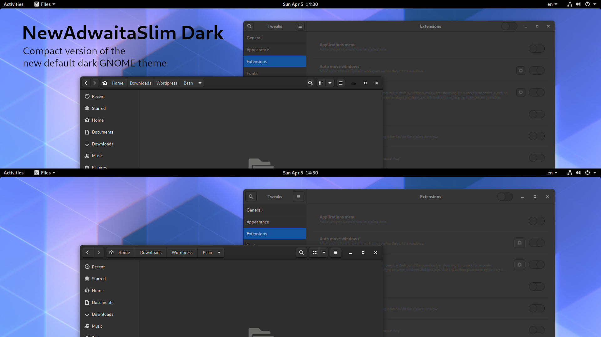

# NewAdwaitaSlimDark
Tweak New Adwaita Dark GTK Theme with slim version!

## Preview

## Installation
<ul>
<li>Just unzip the file and place it in your themes directory i.e. ~/.themes/ or /usr/share/themes/</li>
<li>Install gnome-tweaks:</li>
  <ul>
    <li>Debian/Ubuntu</li>
    <ul>sudo apt install gnome-tweaks</ul>
  </ul>
  <ul>
    <li>Fedora</li>
    <ul>sudo dnf install gnome-tweaks</ul>
  </ul>
  <ul>
    <li>Arch</li>
    <ul>sudo pacman -S gnome-tweaks</ul>
  </ul>

<li>Select the theme as 'NewAdwaitaSlimDark'</li>
</ul>
<!--
## Download
[Latest release here](NewAdwaita-slim.tar.xz) also over at [GNOME-Look](https://www.opendesktop.org/p/1288797/).
-->

## Original projects
Original Adwaita:
- https://download.gnome.org/misc/testing/Adwaita/

Original NewAdwaita-Slim theme:
- https://github.com/ManFridayy/NewAdwaita-slim

